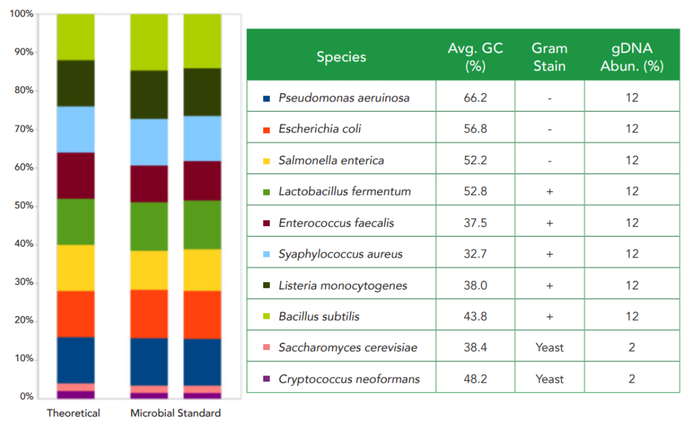

# Mock_OTU_Calculator 🦠

## Overview
This project is a fork of the original repository [agc-tp](https://github.com/aghozlane/agc-tp), aimed at developing a program to calculate the Operational Taxonomic Units (OTUs) from a set of amplicon sequences obtained from a mock sequencing. In this case, only bacterial sequences were amplified (and not fungal sequences), with 8 species expected from the data. Some details about the species are provided below:

<div style="text-align: center;">
    
</div>

The program will perform a **full-length sequence de-duplication**, **search for chimeric sequences**, and cluster the sequences based on an **Abundance Greedy Clustering algorithm**.

## Usage 💻
### Installation
To run the Mock_OTU_Calculator, you need to have Python 3.9 installed along with several dependencies. Below are the steps to set up your environment and install the required packages using conda.

1. Set up a conda environment
```
conda create -n otu_calculator python=3.9
conda activate otu_calculator
```

2. Install Required Dependencies

```
conda install -c conda-forge -c bioconda -c defaults nwalign3 pytest pylint pytest-cov loguru numpy=1.19.5
```

### Running the OTU Calculator
The OTU Calculator can be run using the following command:

```
python agc/agc.py -i [amplicon_file] -s [minseqlen] -m [mincount] -c [chunk_size] -k [kmer_size] -o [output_file]
```

Options :

 - `-i`, -amplicon_file : The path to the amplicon file in FASTA format.
 - `-s`, -minseqlen : The minimum sequence length (optional - default value 400)
 - `-m`, -mincount : The minimum count of a sequence to be considered (optional - default value 10)
 - `-o`, -output_file : The path to the output file in FASTA format.


Example :
```
python agc/agc.py -i data/amplicon.fasta.gz -o results/otus.fasta
```
This will run the OTU Calculator on the `data/amplicon.fasta.gz`, with a minimum sequence length of 400 and a minimum count of 10. The output will be saved in `results/otus.fasta`.


## Testing Results with VSEARCH 🧪

To assess the quality of the OTU calculation, we will use VSEARCH to align the OTUs against the 16S reference sequences of our input data: `mock_16S.fasta`.

Follow these steps to install VSEARCH and perform the alignment:

1. Install VSEARCH:
```
conda install vsearch
```
2. Run the alignment:
```
vsearch  --usearch_global OTU.fasta  --db data/mock_16S.fasta --id 0.8 --blast6out resultat.tsv
```

This will generate an output file resultat.tsv containing the alignment results.  

Below are some of the results from the alignment:

```
vsearch v2.29.0_linux_x86_64, 15.4GB RAM, 4 cores
https://github.com/torognes/vsearch

Reading file data/mock_16S.fasta 100%  
15480 nt in 10 seqs, min 1526, max 1568, avg 1548
Masking 100% 
Counting k-mers 100% 
Creating k-mer index 100% 
Searching 100%  
Matching unique query sequences: 116 of 117 (99.15%)
```
    
```
OTU_1	Lactobacillus_fermentum_16S	100.0	425	0	0	1	425	1	1568	-1	0
OTU_5	Salmonella_enterica_16S_1	100.0	425	0	0	1	425	1	1536	-1	0
OTU_2	Staphylococcus_aureus_16S	100.0	425	0	0	1	425	1	1556	-1	0
...
```

You can find the full results in [`results/resultat.tsv`](results/resultat.tsv).
These results show that the OTUs generated by the program are correctly aligned with the 16S reference sequences of the input data with an identity of 99.15% ! 🎉


## Author 🧑‍💻
- [Essmay Touami](essmay.touami@etu.u-paris.fr)

